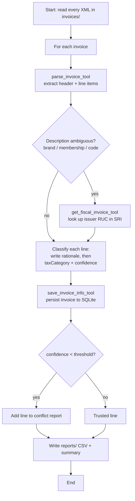

# Pony — Ecuadorian Invoice Tax Classifier Agent

> ⚠️ **Educational project.** Pony was built for learning purposes — to explore how to
> build a tool-using LLM agent with [Effect](https://effect.website) and the Anthropic
> API. It is **not** tax advice and must not be used to file real tax declarations.

## Purpose

Pony is an AI agent that reads Ecuadorian electronic invoices (`file` in XML) and
classifies each line item into the personal-expense tax category defined by the SRI
(_Servicio de Rentas Internas_): `VIVIENDA`, `SALUD`, `EDUCACION`, `ALIMENTACION`,
`VESTIMENTA`, `TURISMO`, `NEGOCIO` or `NO_DEDUCIBLE`.

For every line the agent assigns:

- a **`taxCategory`** — one of the eight categories above,
- a **`confidence`** score between 0 and 1,
- a **`rationale`** — a one-sentence justification written _before_ deciding the category
  (it names the real good/service, ignores brand names, and reconstructs truncated text
  such as `MEMBRES-A` → `MEMBRESÍA`).

Lines whose confidence falls below `CONFIDENCE_THRESHOLD` are routed to a **conflict
report** for a human to review instead of being trusted blindly. Everything else is
persisted to a local SQLite database.

## Agent flow



The reasoning/tool loop is capped at `MAX_TOOL_CALLS` iterations per invoice to avoid
runaway loops; `save_invoice_info_tool` is always the final step for each invoice.

## Requirements

- **Node.js** ≥ 22.13
- **pnpm** (`packageManager: pnpm@11.5.2`)
- An **Anthropic API key** (and optionally an OpenAI key)

## Setup

```bash
# 1. Install dependencies
pnpm install

# 2. Create your environment file and fill in the keys
cp .env.template .env
#   edit .env → set ANTHROPIC_API_KEY, MODEL_PROVIDER, DB_PATH, etc.
```

Key environment variables (see [.env.template](.env.template)):

| Variable               | Purpose                                                        |
| ---------------------- | ------------------------------------------------------------- |
| `ANTHROPIC_API_KEY`    | API key for the Claude models                                 |
| `MODEL_PROVIDER`       | `anthropic` or `openai`                                        |
| `ANTHROPIC_MODEL`      | Model id (e.g. a Claude model)                                 |
| `DB_PATH`              | Path to the SQLite database (e.g. `./db/pony.db`)             |
| `MAX_TOOL_CALLS`       | Max tool iterations per invoice (loop guard)                  |
| `CONFIDENCE_THRESHOLD` | Below this, a line is sent to the conflict report for review  |

## Initialize the database

Create the SQLite schema before the first run:

```bash
pnpm init-db
```

This runs [src/db/init.ts](src/db/init.ts), which applies
[db/db-schemas.sql](db/db-schemas.sql) at the location given by `DB_PATH`.

> To start completely fresh, delete the database file (and its `-wal` / `-shm`
> siblings) and run `pnpm init-db` again — the app also recreates the schema on startup.

## Run

```bash
pnpm start      # process every invoice in invoices/ once
pnpm dev        # same, but restarts on file changes (watch mode)
```

## Project directories

| Directory     | Role                                                                          |
| ------------- | ----------------------------------------------------------------------------- |
| `invoices/`   | **Input.** Drop the `invoice` XML files to be analyzed here.                   |
| `reports/`    | **Output.** The agent writes its analysis here.                               |
| `db/`         | SQLite database and the `db-schemas.sql` DDL.                                  |
| `src/`        | Agent, tools, services and schemas.                                           |

On each run the agent writes two files to `reports/`, timestamped:

- `conflicts-<timestamp>.csv` — one row per low-confidence line, with its `reason` and the
  agent's `rationale`, so a human can reconcile it against the source invoice.
- `summary-<timestamp>.json` — counts of classified vs. conflicting lines.

## Example output

### What is stored in the database

Each processed invoice becomes one header row in `invoices` plus one row per line in
`invoice_lines` (the issuer is cached in `suppliers`). For example, after classifying an
invoice, the tables hold:

> All values below are **fictitious**, for illustration only.

**`invoices`**

| id | access_key                | supplier_ruc  | invoice_number    | issue_date | subtotal | vat  | total | process_status |
| -- | ------------------------- | ------------- | ----------------- | ---------- | -------- | ---- | ----- | -------------- |
| 1  | `0000…0000000000000` (49) | 9999999999001 | 001-001-000000001 | 2026-01-01 | 22.00    | 3.00 | 25.00 | CLASIFICADA    |

**`invoice_lines`** (note `rationale` and `confidence` per line)

| id | invoice_id | line_number | description        | quantity | unit_price | subtotal | tax_category | is_deductible | method | confidence | rationale                                                                     |
| -- | ---------- | ----------- | ------------------ | -------- | ---------- | -------- | ------------ | ------------- | ------ | ---------- | ----------------------------------------------------------------------------- |
| 1  | 1          | 1           | SAMPLE FOOD ITEM   | 2        | 1.00       | 2.00     | ALIMENTACION | 1             | LLM    | 0.97       | Basic non-alcoholic food item.                                                |
| 2  | 1          | 2           | SAMPLE MEMBERSHIP  | 1        | 20.00      | 20.00    | NO_DEDUCIBLE | 0             | LLM    | 0.60       | A club/gym membership is a service, not clothing; brand names in the text are ignored. |

### `reports/summary-<timestamp>.json`

```json
{
  "successLines": 1,
  "conflictLines": 1,
  "conflictFile": "conflicts-2026-01-01T00-00-00-000Z.csv",
  "date": "2026-01-01T00:00:00.000Z"
}
```

### `reports/conflicts-<timestamp>.csv`

Only the lines that scored below `CONFIDENCE_THRESHOLD` land here, so a human can review them:

```csv
invoiceNumber,description,quantity,unitPrice,subtotal,reason,rationale
001-001-000000001,SAMPLE MEMBERSHIP,1,20.00,20.00,Confidence 0.6 < 0.85 (suggested category: NO_DEDUCIBLE),A club/gym membership is a service, not clothing; brand names in the text are ignored.
```

## Useful scripts

```bash
pnpm typecheck   # TypeScript type check (no emit)
pnpm check       # Biome lint + format (writes fixes)
pnpm build       # Compile to dist/
```

## Disclaimer

This repository is an educational exercise about LLM agents and Ecuadorian tax categories.
Classifications are produced by a language model, may be wrong, and should always be
reviewed by a person. It is not a substitute for professional tax advice.
