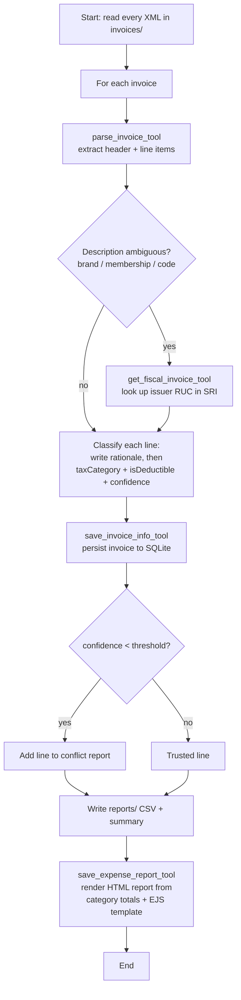

# Pony — Ecuadorian Invoice Tax Classifier Agent

> ⚠️ **Educational project.** Pony was built for learning purposes — to explore how to
> build a tool-using LLM agent with [Effect](https://effect.website) and the Anthropic
> API. It is **not** tax advice and must not be used to file real tax declarations.

## Purpose

Pony is an AI agent that reads Ecuadorian electronic invoices (`file` in XML) and
classifies each line item into an expense category, recording separately whether that
line is deductible.

For every line the agent assigns:

- a **`taxCategory`** — the rubro of the expense (see [the catalogue](#expense-categories)),
- an **`isDeductible`** flag — whether the line counts towards the declaration,
- a **`confidence`** score between 0 and 1,
- a **`rationale`** — a one-sentence justification written _before_ deciding the category
  (it names the real good/service, ignores brand names, and reconstructs truncated text
  such as `MEMBRES-A` → `MEMBRESÍA`).

## Expense categories

The category says **what** was bought; `isDeductible` says whether it can be deducted.
They are independent on purpose: a non-deductible expense still gets a specific rubro, so
the report can explain _what_ the non-deductible money went on instead of dumping it all
into one bucket.

**Deductible rubros (SRI).** Only these may carry `isDeductible = 1` — the DB enforces it
with a `CHECK` constraint, and `InvoiceService` re-applies the same rule before writing.

| Category       | Covers                                                       |
| -------------- | ------------------------------------------------------------ |
| `VIVIENDA`     | Rent, household utilities, mortgage interest                  |
| `SALUD`        | Medicines, medical fees, health insurance, glasses            |
| `EDUCACION`    | Tuition, school supplies, uniforms, courses                   |
| `ALIMENTACION` | Food and non-alcoholic beverages                              |
| `VESTIMENTA`   | Clothing and footwear (not luxury accessories)                |
| `TURISMO`      | Domestic lodging, tour packages, tourist transport            |
| `NEGOCIO`      | Expenses tied to the taxpayer's economic activity             |

A deductible rubro is not automatically deductible: the agent sets `isDeductible = false`
when the expense does not really qualify (suspended issuer, `NEGOCIO` without a matching
economic activity, etc.).

**Non-deductible rubros.** Always stored with `isDeductible = 0`.

| Category                    | Covers                                                            |
| --------------------------- | ----------------------------------------------------------------- |
| `ENTRETENIMIENTO`           | Cinema, concerts, streaming, video games, sporting events         |
| `VICIOS_Y_LUJOS`            | Tobacco, alcohol, jewellery, luxury goods                         |
| `MULTAS_Y_SANCIONES`        | Traffic fines, late-payment surcharges, administrative penalties  |
| `SERVICIOS_FINANCIEROS`     | Credit-card interest on consumption, bank fees and commissions    |
| `MASCOTAS`                  | Vet, pet food, pet accessories                                    |
| `DONACIONES_NO_CALIFICADAS` | Donations to individuals or entities not recognised by the SRI    |
| `GASTOS_EXTERIOR`           | Purchases abroad without Ecuadorian tax support                   |
| `TECNOLOGIA_PERSONAL`       | Phones, computers, gadgets for personal use                       |
| `TRANSPORTE_PERSONAL`       | Vehicle purchase, fuel, automotive maintenance                    |
| `CUIDADO_PERSONAL`          | Hairdressing, cosmetics, spa, gym                                 |
| `APUESTAS_Y_JUEGOS`         | Lotteries, casinos, sports betting                                |
| `OTROS_NO_DEDUCIBLE`        | Non-deductible expense fitting none of the above (last resort)    |

The catalogue lives in one place — `DEDUCTIBLE_CATEGORIES` / `NON_DEDUCTIBLE_CATEGORIES`
in [src/schemas.ts](src/schemas.ts) — and feeds the tool JSON schema, the report query and
the report template; [db/db-schemas.sql](db/db-schemas.sql) mirrors it in its `CHECK`
constraints.

Lines whose confidence falls below `CONFIDENCE_THRESHOLD` are routed to a **conflict
report** for a human to review instead of being trusted blindly. Everything else is
persisted to a local SQLite database.

## Agent flow


```mermaid
flowchart TD
    A[Start: read every XML in invoices/] --> B[For each invoice]
    B --> C[parse_invoice_tool<br/>extract header + line items]
    C --> D{Description ambiguous?<br/>brand / membership / code}
    D -- yes --> E[get_fiscal_invoice_tool<br/>look up issuer RUC in SRI]
    D -- no --> F[Classify each line:<br/>write rationale, then<br/>taxCategory + isDeductible + confidence]
    E --> F
    F --> G[save_invoice_info_tool<br/>persist invoice to SQLite]
    G --> H{confidence &lt; threshold?}
    H -- yes --> I[Add line to conflict report]
    H -- no --> J[Trusted line]
    I --> K[Write reports/ CSV + summary]
    J --> K
    K --> M[save_expense_report_tool<br/>render HTML report from<br/>category totals + EJS template]
    M --> L[End]
```

Once every invoice is classified and persisted, the batch closes by writing its
report files to `reports/`: the conflict CSV + JSON summary, and a polished,
responsive **HTML report of expenses by category**. The HTML is produced by
rendering the [`templates/expense-report.ejs`](templates/expense-report.ejs)
template against the aggregated data returned by
`InvoiceService.getExpenseReportByCategory()` — no HTML is built in TypeScript,
so the model spends no tokens generating markup.

The reasoning/tool loop is capped at `MAX_TOOL_CALLS` iterations per invoice to avoid
runaway loops; `save_invoice_info_tool` is always the final step for each invoice.

## Requirements

- **Node.js** ≥ 22.13
- **pnpm** (`packageManager: pnpm@11.5.2`)
- An **Anthropic API key** (and optionally an OpenAI key)

## Setup

```bash
# 1. Install dependencies
pnpm install

# 2. Create your environment file and fill in the keys
cp .env.template .env
#   edit .env → set ANTHROPIC_API_KEY, MODEL_PROVIDER, DB_PATH, etc.
```

Key environment variables (see [.env.template](.env.template)):

| Variable               | Purpose                                                        |
| ---------------------- | ------------------------------------------------------------- |
| `ANTHROPIC_API_KEY`    | API key for the Claude models                                 |
| `MODEL_PROVIDER`       | `anthropic` or `openai`                                        |
| `ANTHROPIC_MODEL`      | Model id (e.g. a Claude model)                                 |
| `DB_PATH`              | Path to the SQLite database (e.g. `./db/pony.db`)             |
| `MAX_TOOL_CALLS`       | Max tool iterations per invoice (loop guard)                  |
| `CONFIDENCE_THRESHOLD` | Below this, a line is sent to the conflict report for review  |

## Initialize the database

Create the SQLite schema before the first run:

```bash
pnpm init-db
```

This runs [src/db/init.ts](src/db/init.ts), which applies
[db/db-schemas.sql](db/db-schemas.sql) at the location given by `DB_PATH`.

> To start completely fresh, delete the database file (and its `-wal` / `-shm`
> siblings) and run `pnpm init-db` again — the app also recreates the schema on startup.
>
> There is no migration tooling: the DDL uses `CREATE TABLE IF NOT EXISTS`, so an existing
> database keeps its old `CHECK` constraints and will reject any category added to the
> catalogue afterwards. After changing the categories, delete the database file and
> re-initialize it.

## Run

```bash
pnpm start      # process every invoice in invoices/ once
pnpm dev        # same, but restarts on file changes (watch mode)
pnpm resolve    # apply a resolution file — see "Resolving conflicts"
```

## Project directories

| Directory     | Role                                                                          |
| ------------- | ----------------------------------------------------------------------------- |
| `invoices/`   | **Input.** Drop the `invoice` XML files to be analyzed here.                   |
| `reports/`    | **Output.** The agent writes its analysis here.                               |
| `resolutions/`| **Input.** Hand-written `resolution-<timestamp>.json` files (see below).       |
| `templates/`  | EJS templates for the rendered reports (e.g. `expense-report.ejs`).           |
| `db/`         | SQLite database and the `db-schemas.sql` DDL.                                  |
| `src/`        | Agent, tools, services and schemas.                                           |

On each run the agent writes three files to `reports/`, timestamped:

- `conflicts-<timestamp>.csv` — one row per low-confidence line, with its `reason` and the
  agent's `rationale`, so a human can reconcile it against the source invoice. Its first
  column, `invoiceLineId`, is the `invoice_lines.id` (a UUID) of the row — the handle used to
  resolve the conflict. Written only when there is at least one conflicting line.
- `summary-<timestamp>.json` — counts of classified vs. conflicting lines.
- `report-<timestamp>.html` — a polished, responsive report of **expenses by category**
  (base, IVA, total, deductible base and share of the total per rubro), split into the
  deductible rubros and the breakdown of the non-deductible spend, rendered from the
  `templates/expense-report.ejs` template. Always generated at the end of the run, even when
  there are no conflicts (it renders an empty-state message if nothing was classified yet),
  and again after every applied resolution — see below.

## Resolving conflicts

The lines in `conflicts-<timestamp>.csv` stay in the database with the category the agent
guessed and its low confidence. To correct them, write a **resolution file** —
`resolutions/resolution-<timestamp>.json`, an array of verdicts — and apply it:

```bash
pnpm resolve                                             # newest file in resolutions/
pnpm resolve resolutions/resolution-2026-01-01T00-00-00-000Z.json
```

Each entry names one line by the `invoiceLineId` copied from the conflict CSV and gives the
category it really belongs to:

```json
[
  {
    "invoiceLineId": "cad86cfd-d522-45d2-a7d2-067a0c74609b",
    "category": "ALIMENTACION",
    "isDeductible": true
  },
  {
    "invoiceLineId": "b9a98b19-e6cd-4989-b8a1-883bf1cb8587",
    "category": "VICIOS_Y_LUJOS",
    "isDeductible": false
  }
]
```

The id is validated as a UUID, so a truncated or mistyped paste is rejected at decode time
instead of quietly matching no row.

For every entry applied, the line is rewritten as a human decision:

- `tax_category` and `is_deductible` take the user's verdict — with the catalogue still
  having the last word, so a non-deductible rubro is stored as `is_deductible = 0` even if
  the file asks for `true`.
- `method` becomes `HUMANO` and `confidence` becomes `1`: the user looked at the line, so
  the agent's score no longer means anything for it.
- `rationale` is prefixed with **`[MANUAL-TAGGED]`**, keeping the agent's original wording
  behind the marker. Re-applying the same file does not stack markers.

An entry whose id is not in the database is reported and skipped — the rest of the file is
still applied, and the command exits non-zero so a partial run is not mistaken for a clean
one. A malformed file (unknown category, id that is not a UUID) is rejected as a whole
before anything is written.

Because a resolution moves money between rubros, the command finishes by rendering a fresh
`reports/report-<timestamp>.html` from the updated database — so the newest report on disk is
never the pre-resolution one. If no line changed, the existing report still holds and none
is written.

## Example output

### What is stored in the database

Each processed invoice becomes one header row in `invoices` plus one row per line in
`invoice_lines` (the issuer is cached in `suppliers`). For example, after classifying an
invoice, the tables hold:

> All values below are **fictitious**, for illustration only.

**`invoices`**

| id | access_key                | supplier_ruc  | invoice_number    | issue_date | subtotal | vat  | total | process_status |
| -- | ------------------------- | ------------- | ----------------- | ---------- | -------- | ---- | ----- | -------------- |
| 1  | `0000…0000000000000` (49) | 9999999999001 | 001-001-000000001 | 2026-01-01 | 22.00    | 3.00 | 25.00 | CLASIFICADA    |

**`invoice_lines`** (note `rationale` and `confidence` per line). `id` is a UUID minted by
the app, abbreviated here to keep the table readable:

| id          | invoice_id | line_number | description        | quantity | unit_price | subtotal | tax_category     | is_deductible | method | confidence | rationale                                                                     |
| ----------- | ---------- | ----------- | ------------------ | -------- | ---------- | -------- | ---------------- | ------------- | ------ | ---------- | ----------------------------------------------------------------------------- |
| `b9a98b19…` | 1          | 1           | SAMPLE FOOD ITEM   | 2        | 1.00       | 2.00     | ALIMENTACION     | 1             | LLM    | 0.97       | Basic non-alcoholic food item.                                                |
| `cad86cfd…` | 1          | 2           | SAMPLE MEMBERSHIP  | 1        | 20.00      | 20.00    | CUIDADO_PERSONAL | 0             | LLM    | 0.60       | A gym membership is a personal-care service, not clothing; brand names in the text are ignored. |

### `reports/summary-<timestamp>.json`

```json
{
  "successLines": 1,
  "conflictLines": 1,
  "conflictFile": "conflicts-2026-01-01T00-00-00-000Z.csv",
  "date": "2026-01-01T00:00:00.000Z"
}
```

### `reports/conflicts-<timestamp>.csv`

Only the lines that scored below `CONFIDENCE_THRESHOLD` land here, so a human can review them:

```csv
invoiceNumber,description,quantity,unitPrice,subtotal,reason,rationale
001-001-000000001,SAMPLE MEMBERSHIP,1,20.00,20.00,Confidence 0.6 < 0.85 (suggested category: CUIDADO_PERSONAL, no deducible),A gym membership is a personal-care service, not clothing; brand names in the text are ignored.
```

### `reports/report-<timestamp>.html`

A self-contained (inline CSS, dark) HTML report summarizing every classified, balanced
line grouped by category. It opens with summary cards (total spend, deductible base,
non-deductible base, taxable base, IVA), charts — including a breakdown of _what_ the
non-deductible spend went on — and a per-category table split into two blocks, each with
its own subtotal:

| Categoría                  | Líneas | Base   | IVA   | Total  | Deducible     | % del total |
| -------------------------- | ------ | ------ | ----- | ------ | ------------- | ----------- |
| **Rubros deducibles (SRI)**|        |        |       |        |               |             |
| Alimentación               | 1      | $2.00  | $0.30 | $2.30  | $2.00         | 8.4%        |
| **Rubros no deducibles**   |        |        |       |        |               |             |
| Belleza y cuidado personal | 1      | $20.00 | $3.00 | $23.00 | No deducible  | 91.6%       |

The data comes from `InvoiceService.getExpenseReportByCategory()`, which aggregates
`invoice_lines` (only classified lines on balanced invoices) by `tax_category`, returning
the deductible and non-deductible base per rubro plus a flag marking which block the rubro
belongs to.

## Useful scripts

```bash
pnpm typecheck   # TypeScript type check (no emit)
pnpm check       # Biome lint + format (writes fixes)
pnpm build       # Compile to dist/
```

## Disclaimer

This repository is an educational exercise about LLM agents and Ecuadorian tax categories.
Classifications are produced by a language model, may be wrong, and should always be
reviewed by a person. It is not a substitute for professional tax advice.
